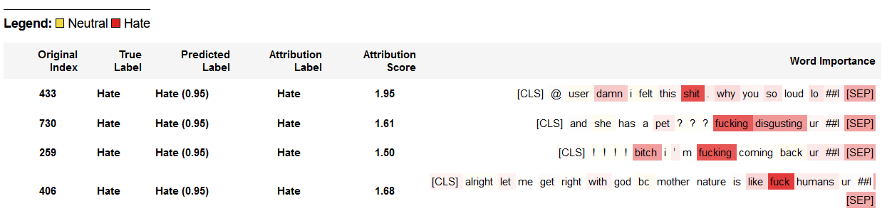
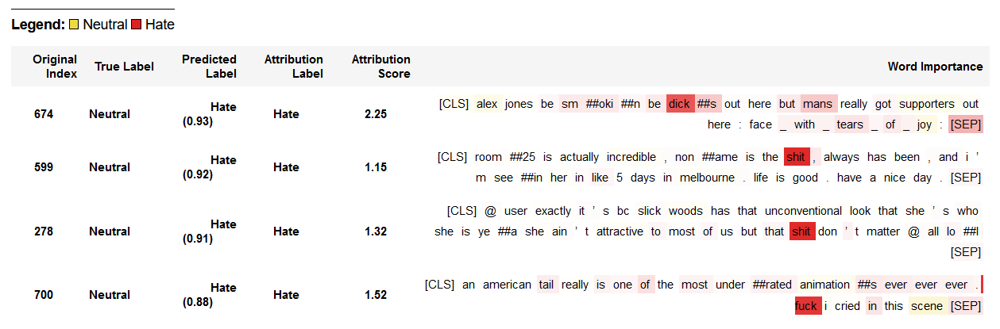

# 🤬 A survey on Hate Speech Detection using NLP algorithms 

**Context**: Final Project for CS7643/CS7650 courses at Georgia Tech, Fall 2021

**Authors**: Aymane Abdali (CS7643/CS7650), Maya Boumerdassi (CS7643), Mohammed Amine Dassouli (CS7643/CS7650), Jonathan Hou (CS7643), Richard Huang (CS7643/CS7650)

## Installation phase

Please refer to [install.md](docs/install.md).

## Training phase

Please refer to [training.md](docs/training.md).

## Trained models

All of our best trained models can be found [here](https://1drv.ms/u/s!Ak4YJhU8zi9qrzdQT5BFOXCfVQ3A?e=xJPiJm).

## Word importance with Captum

This is the qualitative part of our survey. We use [Captum](https://captum.ai/) to interpret our trained models. Here are some examples from our best trained model `DistillBert_2021-12-08_16-39-08_trained_testAcc=0.7960.pth` on the test set:

#### True Positive

#### False Positive

Please refer to [interpret.md](docs/interpret.md) for more details.
